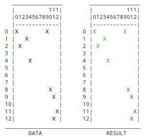

# kddbscan-rs 
[](https://github.com/whizsid/kddbscan-rs/actions) [](https://crates.io/crates/kddbscan) [](./LICENSE) [](http://docs.rs/kddbscan) [](https://docs.rs/kddbscan)

Rust implementation of the kddbscan clustering algorithm.

From the authors of kDDBSCAN algorithm.

> Due to the adoption of global parameters, DBSCAN fails to
> identify clusters with different and varied densities. To
> solve the problem, this paper extends DBSCAN by exploiting
> a new density definition and proposes a novel algorithm
> called k -deviation density based DBSCAN (kDDBSCAN). Various
> datasets containing clusters with arbitrary shapes and
> different or varied densities are used to demonstrate the
> performance and investigate the feasibility and practicality
> of kDDBSCAN. The results show that kDDBSCAN performs
> better than DBSCAN.

[Read More](https://www.researchgate.net/publication/323424266_A_k_-Deviation_Density_Based_Clustering_Algorithm)

## Installation

Add `kddbscan` as a dependency in your `Cargo.toml` file

```toml
[dependencies]
kddbscan = "0.1.0"
```

## Usage

Implement `IntoPoint` trait on your point struct. And pass a vector of points to the `cluster` function.

```rust
use kddbscan::{cluster, IntoPoint, ClusterId};

pub struct Coordinate {
    pub x: f64,
    pub y: f64,
}

impl IntoPoint for Coordinate {
    fn get_distance(&self, neighbor: &Coordinate) -> f64 {
        ((self.x - neighbor.x).powi(2) + (self.y - neighbor.y).powi(2)).powf(0.5)
    }
}

fn main() {
    let mut coordinates: Vec<Coordinate> = vec![];
    coordinates.push(Coordinate { x: 11.0, y: 12.0 });
    coordinates.push(Coordinate { x: 0.0, y: 0.0 });
    coordinates.push(Coordinate { x: 12.0, y: 11.0 });
    coordinates.push(Coordinate { x: 11.0, y: 9.0 });
    coordinates.push(Coordinate { x: 10.0, y: 8.0 });
    coordinates.push(Coordinate { x: 1.0, y: 2.0 });
    coordinates.push(Coordinate { x: 3.0, y: 1.0 });
    coordinates.push(Coordinate { x: 4.0, y: 4.0 });
    coordinates.push(Coordinate { x: 9.0, y: 0.0 });

    let clustered =  cluster(coordinates, 2, None, None);
}
```

## Showcase

This is the output of example project.



## Contribution

All PRs and issues are welcome. and starts are also welcome.

## License

This project is under the MIT license and the algorithm is under the CC BY 4.0 license.